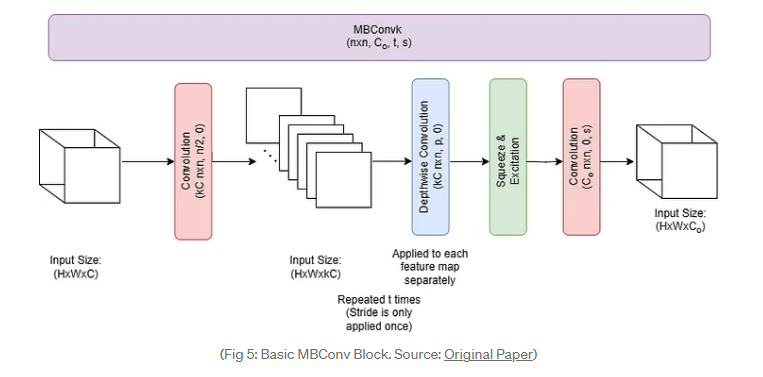
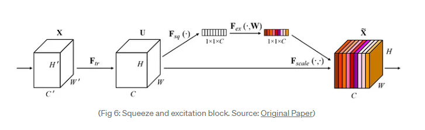
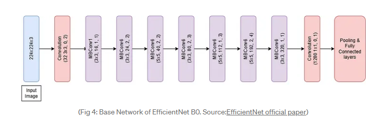

# MRI Image Classification with Convolutional Neural Networks (CNN-Classification)

CNN-Classification is a Python project designed for MRI image classification tasks. It includes a custom dataset class for loading MRI images and a convolutional neural network (CNN) model for classification. This README provides an overview of the project structure, usage instructions, and other relevant details.

## Overview

- **classes.py**: Defines a `CustomDataset` class to load MRI images and their corresponding class labels. It utilizes PyTorch's Dataset class and torchvision's transforms for preprocessing. Also, contains the `MRI_Classification_CNN` model built using PyTorch's nn.Module for classification tasks. Finally, there is an implementation of the EfficientNet architecture as described in the official paper [EfficientNet](https://arxiv.org/abs/1905.11946).
- **helper_functions.py**: Contains various helper functions for data processing, model training, evaluation, and visualization.
- **cnn.py**: Orchestrates the training and evaluation process. It imports necessary classes and functions, defines hyperparameters, creates datasets and data loaders, trains the CNN model, and evaluates its performance. Additionally, it saves the trained model, plots loss curves, data distribution, and accuracy per class.

## File Structure

- **classes.py**: Contains the implementation of `CustomDataset`, `MRI_Classification_CNN`, `ConvBlock`, `MBBlock`, `SqueezeExcitation`, and `EfficientNet`.
- **helper_functions.py**: Contains various helper functions that plot metrics, help with training, evaluating, and saving the model, and more.
- **cnn.py**: Orchestrates training and evaluation while also saving the plotted metrics and information of the hyperparameters used.

## Dataset

The dataset used is the [Brain Tumor Classification (MRI)](https://www.kaggle.com/datasets/sartajbhuvaji/brain-tumor-classification-mri) dataset from Kaggle. It includes MRI images of brain tumors along with their class labels.

## Classes

The classes used for this project are:

- **CustomDataset**
- **MRI_Classification_CNN**
- **ConvBlock**
- **MBBlock**
- **SqueezeExcitation**
- **EfficientNet**

The `ConvBlock`, `MBBlock`, and `SqueezeExcitation` classes are used to implement the `EfficientNet` architecture with the following structure:

## Dependencies

- Python (>= 3.9)
- PyTorch (>= 2.0)
- torchvision
- Pillow (PIL)
- Matplotlib
- NumPy
- tqdm

## Contributors

- [Theodoros Taloumtzis](https://github.com/theodorostaloumtzis)
